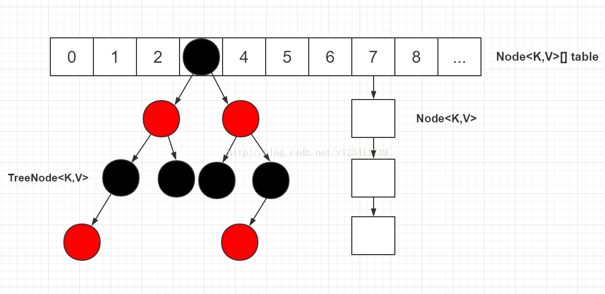
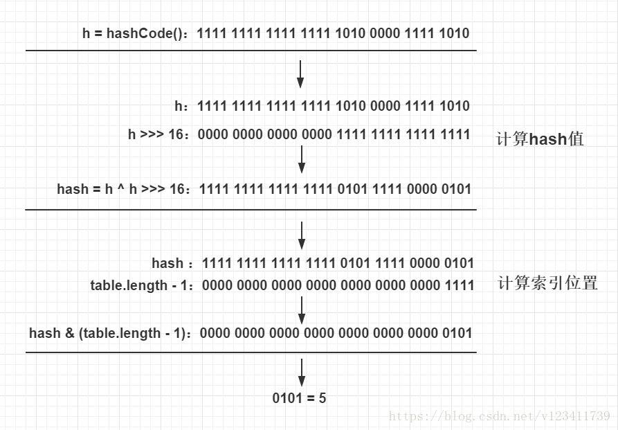

# 学习笔记
## HashMap分析 `jdk1.8`
### 一：put

`JDK 1.8 的 HashMap 的数据结构如下图所示，当链表节点较少时仍然是以链表存在，当链表节点较多时（大于8）会转为红黑树。`

##### 既然是数组，那就有下标，那么hashmap的下标是如何求出来的,查看hashmap的put方法，发现其调用了一个`hash`的内部方法

```java
public V put(K key, V value) {
        return putVal(hash(key), key, value, false, true);
}
```
##### 来看看java是如何求出hash值的
```java
static final int hash(Object key) {
        int h;
        return (key == null) ? 0 : (h = key.hashCode()) ^ (h >>> 16);
}
```
首先获取key的Objects原生方法hashCode()`32位2进制数`

将这个数向右移16位，目的是让高16位参与运算，目的是为了降低冲突。再用位异或（^）操作得到hash值


### putVal
```java 
final V putVal(int hash, K key, V value, boolean onlyIfAbsent,
               boolean evict) {
    Node<K,V>[] tab; Node<K,V> p; int n, i;
    // 1.校验table是否为空或者length等于0，如果是则调用resize方法进行初始化
    if ((tab = table) == null || (n = tab.length) == 0)
        n = (tab = resize()).length;
    // 2.通过hash值计算索引位置，将该索引位置的头节点赋值给p，如果p为空则直接在该索引位置新增一个节点即可
    if ((p = tab[i = (n - 1) & hash]) == null)
        tab[i] = newNode(hash, key, value, null);
    else {
        // table表该索引位置不为空，则进行查找
        Node<K,V> e; K k;
        // 3.判断p节点的key和hash值是否跟传入的相等，如果相等, 则p节点即为要查找的目标节点，将p节点赋值给e节点
        if (p.hash == hash &&
            ((k = p.key) == key || (key != null && key.equals(k))))
            e = p;
        // 4.判断p节点是否为TreeNode, 如果是则调用红黑树的putTreeVal方法查找目标节点
        else if (p instanceof TreeNode)
            e = ((TreeNode<K,V>)p).putTreeVal(this, tab, hash, key, value);
        else {
            // 5.走到这代表p节点为普通链表节点，则调用普通的链表方法进行查找，使用binCount统计链表的节点数
            for (int binCount = 0; ; ++binCount) {
                // 6.如果p的next节点为空时，则代表找不到目标节点，则新增一个节点并插入链表尾部
                if ((e = p.next) == null) {
                    p.next = newNode(hash, key, value, null);
                    // 7.校验节点数是否超过8个，如果超过则调用treeifyBin方法将链表节点转为红黑树节点，
                    // 减一是因为循环是从p节点的下一个节点开始的
                    if (binCount >= TREEIFY_THRESHOLD - 1)
                        treeifyBin(tab, hash);
                    break;
                }
                // 8.如果e节点存在hash值和key值都与传入的相同，则e节点即为目标节点，跳出循环
                if (e.hash == hash &&
                    ((k = e.key) == key || (key != null && key.equals(k))))
                    break;
                p = e;  // 将p指向下一个节点
            }
        }
        // 9.如果e节点不为空，则代表目标节点存在，使用传入的value覆盖该节点的value，并返回oldValue
        if (e != null) {
            V oldValue = e.value;
            if (!onlyIfAbsent || oldValue == null)
                e.value = value;
            afterNodeAccess(e); // 用于LinkedHashMap
            return oldValue;
        }
    }
    ++modCount;
    // 10.如果插入节点后节点数超过阈值，则调用resize方法进行扩容
    if (++size > threshold)
        resize();
    afterNodeInsertion(evict);  // 用于LinkedHashMap
    return null;
```
通过学习putVal发现，将计算出来的 hash 值与 (table.length - 1) 进行 & 运算得到下标

`位运算(&)效率要比代替取模运算(%)高很多，主要原因是位运算直接对内存数据进行操作，不需要转成十进制，因此处理速度非常快。`

### 值得注意的几点
1.当存在下标相同的元素，那么HashMap会在对应下标的node插入一个新的node节点，如果节点数超过8个，则转为红黑树

2.当节点数超过阈值：size>threshold就会触发扩容

threshold定义如下
```java
/**
     * The next size value at which to resize (capacity * load factor).
     *
     * @serial
     */
    // (The javadoc description is true upon serialization.
    // Additionally, if the table array has not been allocated, this
    // field holds the initial array capacity, or zero signifying
    // DEFAULT_INITIAL_CAPACITY.)
    int threshold;
```
capacity的默认值为16，load factor的默认值为0.75

即当size的数量大于12时，`也就是在第13次put操作时`会触发hashmap的扩容机制，扩容机制也是为了降低hash冲突的几率而设置的。

3.hashmap的初始大小16

真正创建一个16长度的数组是在第一次put的时候，做一次判断，如果长度为0或者为null的话，就做一次扩容，数组也是在这个时候初始化的

如果我们传入一个初始长度。java也会找到一个传入的参数最近的一个2的幂
```java
    static final int tableSizeFor(int cap) {
        int n = cap - 1;
        n |= n >>> 1;
        n |= n >>> 2;
        n |= n >>> 4;
        n |= n >>> 8;
        n |= n >>> 16;
        return (n < 0) ? 1 : (n >= MAXIMUM_CAPACITY) ? MAXIMUM_CAPACITY : n + 1;
    }
```
### 二：get
